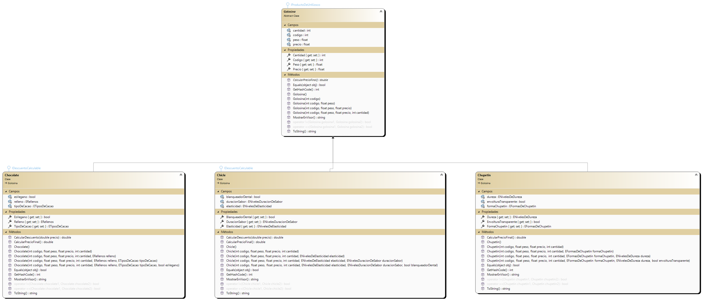
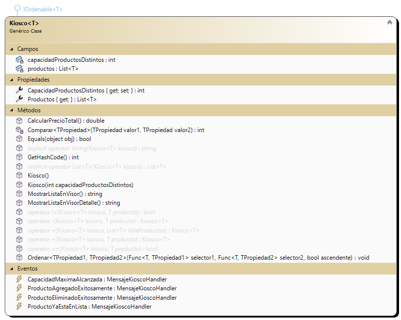
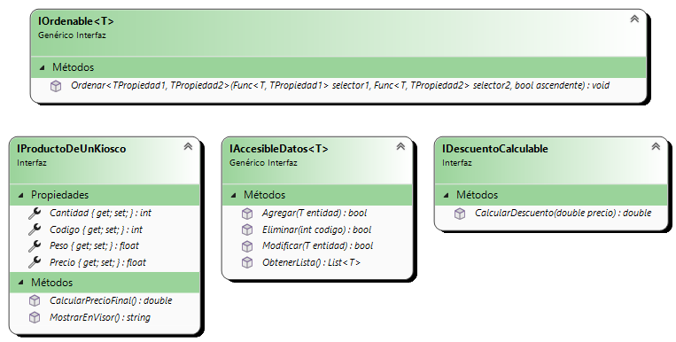
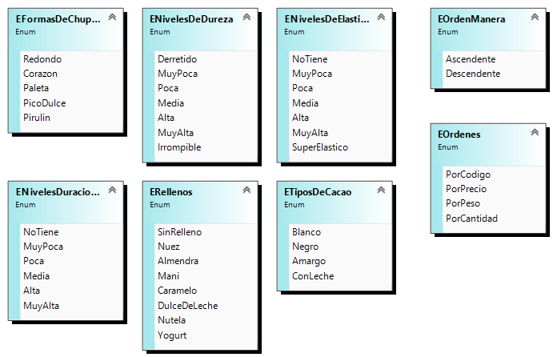

# Gargiulo.Luca.PrimerParcialLabo2

# Laboratorio 2  Segundo Parcial

# KioscoApp - Gestion de Golosinas

## Alumno: Gargiulo Luca
Me llamo Luca Franco Gargiulo Nicola, tengo 20 años, vivo en Lanus, Buenos Aires. Estoy cursando la carrera tecnico en Programacion en la Universidad Tecnologica Nacional de Avellaneda. Este proyecto fue creado por mi persona, es mi entrega del primer parcial de Laboratorio II. Implememte lo mejor que pude todos los conocimientos que adquiri hasta el momento por esta materia y por Programacion II.

## Resumen
La aplicacion KioscoApp esta diseñada para administrar un kiosco de golosinas. Permite al usuario que inicio sesion, agregar, modificar, eliminar, ordenar golosinas de distintos tipos (chocolates, chicles, chupetines). Ademas, tiene funcionalidades para cargar y guardar datos de golosinas en archivos XML y JSON.

### Log In
Es un formulario diseñado para la autenticacion de usuarios mediante un sistema de login. Permite cargar una lista de usuarios desde un archivo JSON al inicializarse, validar las credenciales ingresadas por el usuario (correo electronico y clave), registrar accesos exitosos utilizando un archivo de registro, y abrir un formulario principal (FrmMenuPrincipal) si las credenciales son validas. Ademas, incluye manejo de eventos para confirmar la salida del programa, garantizando una terminacion adecuada de la aplicacian.

## Menú Principal

### Inicio de Sesion
- Al iniciar sesion correctamente, se muestra el nombre del operador y la fecha actual en el formulario principal.

## Sus funcionalidades son: 

### 1. Administracion de Golosinas
#### Agregar Golosinas
- Permite añadir chocolates, chicles y chupetines al kiosco usando formularios especificos.
#### Modificar Golosinas
- Permite cambiar los detalles de golosinas existentes seleccionandolas desde una lista y editandolas.
#### Eliminar Golosinas
- Permite eliminar golosinas seleccionadas del kiosco después de confirmacion del usuario.

### 2. Ordenamiento de Golosinas
#### Ordenar por Criterios
- Permite organizar las golosinas en el kiosco segun diferentes criterios elegidos desde un menu ComboBox, tanto en orden ascendente como descendente.

### 3. Gestion de Archivos
#### Guardar y Cargar Datos
- Ofrece opciones para guardar y cargar informacion de golosinas en archivos XML usando la clase SerializadorXML.

### 4. Administracion del Formulario
#### Configuracion de Formulario
- Ajusta el formulario principal para gestionar multiples ventanas de manera eficiente usando MDI.

#### Cierre del Formulario
- Muestra un mensaje de confirmacion antes de cerrar el formulario principal para evitar perdida de datos accidentales.

### 5. Informacion y Detalles del Kiosco
#### Mostrar Detalles del Kiosco
- Presenta detalles del kiosco, incluyendo informacion sobre descuentos aplicables a las golosinas, en un formulario separado.

### 6. Gestion de Usuarios Logueados
#### Visualizacion de Usuarios Logueados
- Abre un formulario que lleva un registro de los usuarios que ingresaron a la aplicacion.

### 7. Retroceso
#### Volver al Formulario de Login
- Permite al usuario regresar al formulario de inicio de sesión, con confirmacion previa para evitar salidas accidentales.

### 8. Utilizacion de Eventos
#### Eventos
- La aplicacion utiliza eventos para manejar diversas situaciones, como alcanzar la capacidad máxima del kiosco, agregar o eliminar golosinas con exito, entre otros.

### 9. Gestion Base de Datos
#### Guardar y Cargar Datos
- Interactua con una base de datos SQL Server para almacenar y recuperar informacion de golosinas. Esto incluye operaciones como guardar y cargar golosinas, implementadas de manera asincronica para no bloquear la interfaz de usuario.

### 10. Utilizacion de Delegados e Hilos
#### Delegados
- Se utilizan para manejar eventos y asegurar que las operaciones se realicen en el hilo adecuado para interactuar de manera segura con la interfaz de usuario.
#### Hilos
- Implementados para tareas como la actualizacion continua del reloj en la interfaz y para ejecutar operaciones de guardado y carga en segundo plano, sin bloquear la interfaz principal.

# SQl:
### clase AccesoDatos:
La clase AccesoDatos facilita la interaccion con una base de datos SQL Server para operaciones CRUD (Crear, Leer, Actualizar, Eliminar) sobre objetos Golosina. Utiliza la biblioteca Microsoft.Data.SqlClient para la conexion y ejecucion de comandos SQL.

- ProbarConexion: Verifica si es posible establecer una conexion con la base de datos.
- ObtenerListaGolosinas: Recupera una lista de golosinas almacenadas en la base de datos y las convierte en objetos Golosina.
- AgregarGolosina: Inserta una nueva golosina en la base de datos, adaptándose dinsmicamente al tipo de golosina especifica (Chocolate, Chicle, Chupetin).
- ModificarGolosina: Actualiza los datos de una golosina existente en la base de datos.
- EliminarGolosina: Elimina una golosina de la base de datos segun su codigo.
- CrearGolosinaDesdeDataReader: Construye un objeto Golosina a partir de los datos obtenidos de un lector de datos.
- BorrarTodasLasGolosinas: Elimina todas las golosinas de la base de datos.
La clase esta diseñada para manejar varios tipos de golosinas y garantizar la conexion segura y la ejecucion de consultas SQL, manejando excepciones y asegurando la correcta apertura y cierre de la conexion.

# Entidades:

## Jerarquia y Contenedora:

### clase Golosina
Representa una golosina generica con propiedades para codigo, precio, peso y cantidad. Permite la serialización XML y estáA diseñada para ser la base de clases concretas como Chocolate, Chicle y Chupetin. Incluye validaciones con excepciones para el codigo (numerico, no negativo y no mayor a 1000) y metodos para mostrar detalles, calcular precios finales y comparar golosinas.

### clase Chocolate
Representa un tipo especifico de golosina, que incluye atributos como relleno, tipo de cacao y si es vegano. Tiene varios constructores para inicializar estas propiedades de diferentes maneras. Sobrescribe metodos de la clase base Golosina y define sus propios metodos, como ToString para mostrar informacion detallada, Equals para comparar si dos chocolates son iguales, y CalcularPrecioFinal para calcular el precio final con descuento si se compran mas de tres. También implementa la interfaz IDescuentoCalculable para aplicar descuentos. Ademas, sobrecarga los operadores de igualdad == y != para comparar dos instancias de Chocolate.

### clase Chicle
representa una golosina del tipo especifico chicle, heredando de la clase base Golosina y implementando la interfaz IDescuentoCalculable. Define atributos especificos del chicle como elasticidad, duracion del sabor, y si contiene blanqueador dental. Proporciona propiedades para acceder y modificar estos atributos, así como multiples constructores para inicializarlos. La clase sobrescribe metodos de Object como ToString, Equals, y GetHashCode, y tambien define metodos especificos para calcular descuentos y mostrar informacion en un visor. Adicionalmente, la clase implementa sobrecargas de operadores de igualdad para comparar instancias de chicles.

### clase Chupetin
Representa un tipo especifico de golosina, un chupetin. Tiene atributos que definen su forma, dureza y si tiene envoltura transparente. Además de los metodos y propiedades basicos heredados de la clase base Golosina, la clase Chupetin incluye constructores para inicializar estos atributos y metodos para mostrar su información, calcular su precio final, y comparar si dos chupetines son iguales.

### Clase Kiosco
Es una implementacion generica que representa un kiosco capaz de almacenar una variedad de productos. Utiliza una lista interna para mantener los productos y ofrece metodos y operadores para agregar, eliminar y visualizar estos productos. Con eventos estaticos, notifica sobre eventos como alcanzar la capacidad maxima del kiosco, agregar o eliminar exitosamente productos, y permite la personalizacion del ordenamiento de productos basado en criterios especificos. Ademas, la clase sobrecarga operadores para facilitar la gestion de productos, y proporciona metodos para calcular el precio total de los productos almacenados y para convertir el kiosco en una lista o una cadena de texto segun sea necesario. Esta estructura ofrece flexibilidad y funcionalidad robusta para la gestion eficiente de inventarios en un entorno de kiosco. Tiene una restriccion que es que los productos que se manejan deben tener implementada la interfaz IProductoDeUnKiosco.

## Serializadoras:

### clase Serializador
Es una clase abstracta que proporciona una base comun para la serializacion y deserializacion de archivos, manejando la ruta del archivo donde se realizaran estas operaciones. Permite establecer y obtener la ruta del archivo, asegurando que la ruta sea absoluta y creando automaticamente el directorio necesario si no existe.

### clase SerializadorXML
 Maneja la serializacion y deserializacion de objetos genericos en formato XML, con soporte especifico para los tipos Chocolate, Chicle y Chupetin. Hereda de la clase Serializador para gestionar las rutas de los archivos de manera flexible, permitiendo usar rutas absolutas o relativas. Implementa metodos estaticos para serializar y deserializar listas de objetos, manejando excepciones para asegurar la robustez del proceso.

### clase SerializadorJSON
Maneja la deserializacion de un Json de usuarios. El metodo DeserializarUsuariosJSON especificamente deserializa un archivo JSON que contiene datos de usuarios y los convierte en una lista de objetos Usuario. Utiliza las clases de System.Text.Json para leer el contenido del archivo y convertirlo de JSON a objetos Usuario.

### clase Usuario
La clase Usuario representa un usuario con sus datos basicos. Incluye propiedades para el apellido, nombre, numero de legajo, correo electronico, clave y perfil.

### clase UsuarioLog
Esta clase gestiona un registro de accesos de usuarios en un archivo de registro especifico. Permite la verificacion y creacion del archivo si no existe, registra detalles de acceso de usuarios y facilita la lectura completa del contenido del registro.

# Formularios:

## Jerarquia:

### FrmGolosina
Es un formulario diseñado para capturar y validar información de golosinas, incluyendo codigo, precio, peso y cantidad. Utiliza eventos como btnAceptar_Click para validar los datos ingresados por el usuario y mostrar mensajes de error especificos mediante excepciones personalizadas (ExcepcionDatoNoNumerico, ExcepcionNumeroNegativo, ExcepcionNumeroMuyAlto). Ademas, ofrece la opcion de cancelar la operacion con el boton btnCancelar_Click, proporcionando una experiencia interactiva y segura al usuario al manejar adecuadamente las entradas numericas y el flujo de cancelacion.

### FrmChocolate
Es un formulario diseñado para ingresar y editar informacion especifica de chocolates. Hereda funcionalidades del formulario base FrmGolosina, permitiendo configurar y mostrar detalles como el codigo, peso, precio, cantidad, relleno, tipo de cacao y opcion vegana de un objeto Chocolate. Ademas, ofrece metodos para inicializar y configurar controles como ComboBoxes con valores especificos de enumeraciones relacionadas con caracteristicas del chocolate, asegurando una interfaz de usuario coherente y funcional para la gestion de datos de chocolates.

### FrmChicle
Es un formulario diseñado para ingresar y editar informacion especifica de chicles. Hereda funcionalidades del formulario base FrmGolosina, permitiendo configurar y mostrar detalles como el codigo, peso, precio, cantidad, elasticidad, duracion del sabor y opcion blanqueador dental de un objeto Chicle. Ademas, ofrece metodos para inicializar y configurar controles como ComboBoxes con valores especificos de enumeraciones relacionadas con caracteristicas del chicle, asegurando una interfaz de usuario coherente y funcional para la gestion de datos de chicles.

### FrmChupetin
Es un formulario diseñado para ingresar y editar informacion especifica de chupetines. Hereda funcionalidades del formulario base FrmGolosina, permitiendo configurar y mostrar detalles como el codigo, peso, precio, cantidad, forma, dureza y opcion de envoltura transparente de un objeto Chupetin. Ademas, ofrece metodos para inicializar y configurar controles como ComboBoxes con valores especificos de enumeraciones relacionadas con caracteristicas del chupetin, asegurando una interfaz de usuario coherente y funcional para la gestion de datos de chupetines.

## Otros Formularios:

### FrmVisualizadorUsuariosLog
Esta clase tiene como objetivo mostrar el contenido de un archivo de registro de usuarios en un ListBox. Al recibir la ruta del archivo de registro en su constructor, inicializa una instancia de UsuarioLog para manejar las operaciones de lectura del archivo. El metodo MostrarLog() lee el contenido del archivo, lo divide por lineas utilizando Environment.NewLine como separador, y luego agrega cada linea al ListBox lstVisualizadorUsuariosLog para visualizacion en la interfaz grafica. Esta clase proporciona una manera eficiente y clara de visualizar registros de acceso de usuarios almacenados en archivos.

### FrmDetalleKiosco
Es un formulario diseñado para mostrar el detalle del kiosco de golosinas. Incluye un metodo publico MostrarDetalleEnVisor que toma una cadena de detalle y la muestra en un ListBox (lstVisorDetalleKiosco), separando cada linea para una presentacion clara y ordenada del contenido del kiosco.

# Diagrama con las Interfaces

# Diagrama con los Enumerados

# Diagrama de Clases con todo:

# Script:
USE [master]
GO
/****** Object:  Database [Kiosco]    Script Date: 26/6/2024 13:24:46 ******/
CREATE DATABASE [Kiosco]
 CONTAINMENT = NONE
 ON  PRIMARY 
( NAME = N'Kiosco', FILENAME = N'C:\SQLData\Kiosco.mdf' , SIZE = 8192KB , MAXSIZE = UNLIMITED, FILEGROWTH = 65536KB )
 LOG ON 
( NAME = N'Kiosco_log', FILENAME = N'C:\SQLData\Kiosco_log.ldf' , SIZE = 8192KB , MAXSIZE = 2048GB , FILEGROWTH = 65536KB )
 WITH CATALOG_COLLATION = DATABASE_DEFAULT, LEDGER = OFF
GO
ALTER DATABASE [Kiosco] SET COMPATIBILITY_LEVEL = 160
GO
IF (1 = FULLTEXTSERVICEPROPERTY('IsFullTextInstalled'))
begin
EXEC [Kiosco].[dbo].[sp_fulltext_database] @action = 'enable'
end
GO
ALTER DATABASE [Kiosco] SET ANSI_NULL_DEFAULT OFF 
GO
ALTER DATABASE [Kiosco] SET ANSI_NULLS OFF 
GO
ALTER DATABASE [Kiosco] SET ANSI_PADDING OFF 
GO
ALTER DATABASE [Kiosco] SET ANSI_WARNINGS OFF 
GO
ALTER DATABASE [Kiosco] SET ARITHABORT OFF 
GO
ALTER DATABASE [Kiosco] SET AUTO_CLOSE OFF 
GO
ALTER DATABASE [Kiosco] SET AUTO_SHRINK OFF 
GO
ALTER DATABASE [Kiosco] SET AUTO_UPDATE_STATISTICS ON 
GO
ALTER DATABASE [Kiosco] SET CURSOR_CLOSE_ON_COMMIT OFF 
GO
ALTER DATABASE [Kiosco] SET CURSOR_DEFAULT  GLOBAL 
GO
ALTER DATABASE [Kiosco] SET CONCAT_NULL_YIELDS_NULL OFF 
GO
ALTER DATABASE [Kiosco] SET NUMERIC_ROUNDABORT OFF 
GO
ALTER DATABASE [Kiosco] SET QUOTED_IDENTIFIER OFF 
GO
ALTER DATABASE [Kiosco] SET RECURSIVE_TRIGGERS OFF 
GO
ALTER DATABASE [Kiosco] SET  DISABLE_BROKER 
GO
ALTER DATABASE [Kiosco] SET AUTO_UPDATE_STATISTICS_ASYNC OFF 
GO
ALTER DATABASE [Kiosco] SET DATE_CORRELATION_OPTIMIZATION OFF 
GO
ALTER DATABASE [Kiosco] SET TRUSTWORTHY OFF 
GO
ALTER DATABASE [Kiosco] SET ALLOW_SNAPSHOT_ISOLATION OFF 
GO
ALTER DATABASE [Kiosco] SET PARAMETERIZATION SIMPLE 
GO
ALTER DATABASE [Kiosco] SET READ_COMMITTED_SNAPSHOT OFF 
GO
ALTER DATABASE [Kiosco] SET HONOR_BROKER_PRIORITY OFF 
GO
ALTER DATABASE [Kiosco] SET RECOVERY SIMPLE 
GO
ALTER DATABASE [Kiosco] SET  MULTI_USER 
GO
ALTER DATABASE [Kiosco] SET PAGE_VERIFY CHECKSUM  
GO
ALTER DATABASE [Kiosco] SET DB_CHAINING OFF 
GO
ALTER DATABASE [Kiosco] SET FILESTREAM( NON_TRANSACTED_ACCESS = OFF ) 
GO
ALTER DATABASE [Kiosco] SET TARGET_RECOVERY_TIME = 60 SECONDS 
GO
ALTER DATABASE [Kiosco] SET DELAYED_DURABILITY = DISABLED 
GO
ALTER DATABASE [Kiosco] SET ACCELERATED_DATABASE_RECOVERY = OFF  
GO
ALTER DATABASE [Kiosco] SET QUERY_STORE = ON
GO
ALTER DATABASE [Kiosco] SET QUERY_STORE (OPERATION_MODE = READ_WRITE, CLEANUP_POLICY = (STALE_QUERY_THRESHOLD_DAYS = 30), DATA_FLUSH_INTERVAL_SECONDS = 900, INTERVAL_LENGTH_MINUTES = 60, MAX_STORAGE_SIZE_MB = 1000, QUERY_CAPTURE_MODE = AUTO, SIZE_BASED_CLEANUP_MODE = AUTO, MAX_PLANS_PER_QUERY = 200, WAIT_STATS_CAPTURE_MODE = ON)
GO
USE [Kiosco]
GO
/****** Object:  Table [dbo].[DatosGolosinas]    Script Date: 26/6/2024 13:24:46 ******/
SET ANSI_NULLS ON
GO
SET QUOTED_IDENTIFIER ON
GO
CREATE TABLE [dbo].[DatosGolosinas](
	[tipoDeGolosina] [nvarchar](50) NULL,
	[codigo] [int] NOT NULL,
	[precio] [float] NOT NULL,
	[peso] [float] NOT NULL,
	[cantidad] [int] NOT NULL,
	[tipoDeCacao] [nvarchar](50) NULL,
	[relleno] [nvarchar](50) NULL,
	[esVegano] [bit] NULL,
	[elasticidad] [nvarchar](50) NULL,
	[duracionSabor] [nvarchar](50) NULL,
	[blanqueadorDental] [bit] NULL,
	[formaChupetin] [nvarchar](50) NULL,
	[dureza] [nvarchar](50) NULL,
	[envolturaTransparente] [bit] NULL
) ON [PRIMARY]
GO
INSERT [dbo].[DatosGolosinas] ([tipoDeGolosina], [codigo], [precio], [peso], [cantidad], [tipoDeCacao], [relleno], [esVegano], [elasticidad], [duracionSabor], [blanqueadorDental], [formaChupetin], [dureza], [envolturaTransparente]) VALUES (NULL, 0, 0, 0, 0, N'SinRelleno', N'Negro', 0, NULL, NULL, NULL, NULL, NULL, NULL)
INSERT [dbo].[DatosGolosinas] ([tipoDeGolosina], [codigo], [precio], [peso], [cantidad], [tipoDeCacao], [relleno], [esVegano], [elasticidad], [duracionSabor], [blanqueadorDental], [formaChupetin], [dureza], [envolturaTransparente]) VALUES (NULL, 2, 0, 0, 0, N'SinRelleno', N'Negro', 0, NULL, NULL, NULL, NULL, NULL, NULL)
INSERT [dbo].[DatosGolosinas] ([tipoDeGolosina], [codigo], [precio], [peso], [cantidad], [tipoDeCacao], [relleno], [esVegano], [elasticidad], [duracionSabor], [blanqueadorDental], [formaChupetin], [dureza], [envolturaTransparente]) VALUES (NULL, 3, 0, 0, 0, N'SinRelleno', N'Negro', 0, NULL, NULL, NULL, NULL, NULL, NULL)
INSERT [dbo].[DatosGolosinas] ([tipoDeGolosina], [codigo], [precio], [peso], [cantidad], [tipoDeCacao], [relleno], [esVegano], [elasticidad], [duracionSabor], [blanqueadorDental], [formaChupetin], [dureza], [envolturaTransparente]) VALUES (NULL, 5, 100, 20, 4, NULL, NULL, NULL, NULL, NULL, NULL, N'Paleta', N'Alta', 1)
INSERT [dbo].[DatosGolosinas] ([tipoDeGolosina], [codigo], [precio], [peso], [cantidad], [tipoDeCacao], [relleno], [esVegano], [elasticidad], [duracionSabor], [blanqueadorDental], [formaChupetin], [dureza], [envolturaTransparente]) VALUES (NULL, 10, 10, 2, 0, NULL, NULL, NULL, N'Media', N'Media', 1, NULL, NULL, NULL)
GO
USE [master]
GO
ALTER DATABASE [Kiosco] SET  READ_WRITE 
GO
