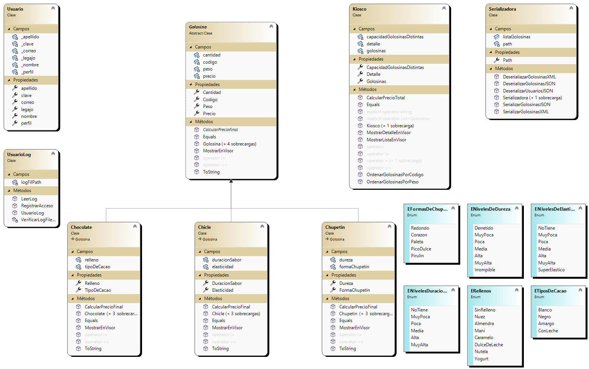

# Gargiulo.Luca.PrimerParcialLabo2
Primer parcial laboratorio 2

# KioscoApp - Gestion de Golosinas

## Alumno: Gargiulo Luca
Me llamo Luca Franco Gargiulo Nicola, tengo 20 años, vivo en Lanus, Buenos Aires. Estoy cursando la carrera tecnico en Programacion en la Universidad Tecnologica Nacional de Avellaneda. Este proyecto fue creado por mi persona, es mi entrega del primer parcial de Laboratorio II. Implememte lo mejor que pude todos los conocimientos que adquiri hasta el momento por esta materia y por Programacion II.

## Resumen
La aplicacion KioscoApp esta diseñada para administrar un kiosco de golosinas. Permite al usuario que inicio sesion, agregar, modificar, eliminar, ordenar golosinas de distintos tipos (chocolates, chicles, chupetines). Ademas, tiene funcionalidades para cargar y guardar datos de golosinas en archivos XML y JSON.

### Log In
Ingreso de usuarios, pide el correo y su clave, los verifica con el uso de un archivo JSON que contiene los usuarios autorizados

### Menu Principal
- Al iniciar sesion corectamente, se muestra el formulario principal donde se puede ver el nombre del operador y la fecha actual.
- se pueden agregar golosinas de diferentes tipos: chocolate, chicle o chupetin. Se abrira un formulario correspondiente a cada tipo de golosina para ingresar los detalles.
- Una vez agregadas las golosinas, se mostraran en una lista en el formulario principal.
- Se pueden modificar y eliminar golosinas seleccionandolas de la lista y utilizando las opciones correspondientes en el menu.
- Tambien se puede ordenar la lista de golosinas por codigo o peso, de forma ascendente o descendente, desde las opciones del menu.
- La aplicacion permite cargar y guardar datos de golosinas en archivos XML o JSON desde el menu correspondiente.

### FrmVisualizadorUsuariosLog
En el menu se puede clickear una opcion del menuStrip para visualizar el registro de usuarios en un Listbox.  Carga el contenido del archivo de registros de usuarios y lo muestra en una lista.

### Clase Kiosco
Es la clase responsable de gestionar la Lista de Golosinas(esa lista puede tener 3 tipos de Golosina, chocolates, chicles o chupetines)

### Diagrama de Clases

