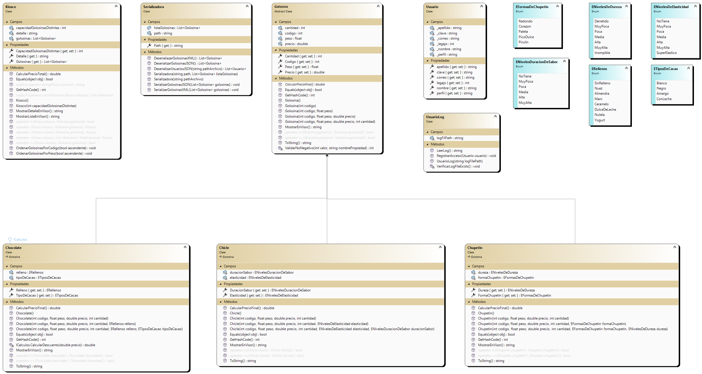

# Gargiulo.Luca.PrimerParcialLabo2

# Laboratorio 2  Segundo Parcial

# KioscoApp - Gestion de Golosinas

## Alumno: Gargiulo Luca
Me llamo Luca Franco Gargiulo Nicola, tengo 20 años, vivo en Lanus, Buenos Aires. Estoy cursando la carrera tecnico en Programacion en la Universidad Tecnologica Nacional de Avellaneda. Este proyecto fue creado por mi persona, es mi entrega del primer parcial de Laboratorio II. Implememte lo mejor que pude todos los conocimientos que adquiri hasta el momento por esta materia y por Programacion II.

## Resumen
La aplicacion KioscoApp esta diseñada para administrar un kiosco de golosinas. Permite al usuario que inicio sesion, agregar, modificar, eliminar, ordenar golosinas de distintos tipos (chocolates, chicles, chupetines). Ademas, tiene funcionalidades para cargar y guardar datos de golosinas en archivos XML y JSON.

### Log In
Es un formulario diseñado para la autenticacion de usuarios mediante un sistema de login. Permite cargar una lista de usuarios desde un archivo JSON al inicializarse, validar las credenciales ingresadas por el usuario (correo electronico y clave), registrar accesos exitosos utilizando un archivo de registro, y abrir un formulario principal (FrmMenuPrincipal) si las credenciales son validas. Ademas, incluye manejo de eventos para confirmar la salida del programa, garantizando una terminacion adecuada de la aplicacian.

### Menu Principal
- Al iniciar sesion corectamente, se muestra el formulario principal donde se puede ver el nombre del operador y la fecha actual.
- se pueden agregar golosinas de diferentes tipos: chocolate, chicle o chupetin. Se abrira un formulario correspondiente a cada tipo de golosina para ingresar los detalles.
- Una vez agregadas las golosinas, se mostraran en una lista en el formulario principal.
- Se pueden modificar y eliminar golosinas seleccionandolas de la lista y utilizando las opciones correspondientes en el menu.
- Tambien se puede ordenar la lista de golosinas por codigo o peso, de forma ascendente o descendente, desde las opciones del menu.
- La aplicacion permite cargar y guardar datos de golosinas en archivos XML o JSON desde el menu correspondiente.

# Entidades:

## Jerarquia y Contenedora:

### Clase Kiosco
La clase Kiosco<T> representa un kiosco que almacena golosinas genericas (T), donde T debe ser un tipo derivado de la clase base Golosina. Permite gestionar y realizar operaciones como agregar, eliminar y mostrar golosinas, así como calcular el precio total de las golosinas almacenadas. Tambien incluye funcionalidades como ordenar golosinas basado en criterios especificos, gestionar eventos cuando se alcanza la capacidad maxima del kiosco o cuando se agregan o eliminan golosinas, y sobrecargas de operadores para facilitar la manipulación de golosinas en el kiosco. Utiliza interfaces.

### clase Golosina
Representa una golosina generica con propiedades para codigo, precio, peso y cantidad. Permite la serialización XML y estáA diseñada para ser la base de clases concretas como Chocolate, Chicle y Chupetin. Incluye validaciones para el codigo (numérico, no negativo y no mayor a 1000) y metodos para mostrar detalles, calcular precios finales y comparar golosinas.

### clase Chocolate
Representa un tipo de golosina con atributos especificos como el tipo de relleno, el tipo de cacao y si es vegano. Hereda de la clase base Golosina y añade funcionalidades adicionales

### clase Chicle
Esta clase representa un tipo especifico de golosina. Hereda de la clase base Golosina y agrega atributos y comportamientos especificos para los chicles

### clase Chupetin
Esta clase representa un tipo especifico de golosina. Hereda de la clase base Golosina y agrega atributos y comportamientos especificos para los chupetines

## Serializadoras:

### clase Serializador
Es una clase abstracta que proporciona una base comun para la serializacion y deserializacion de archivos, manejando la ruta del archivo donde se realizaran estas operaciones. Permite establecer y obtener la ruta del archivo, asegurando que la ruta sea absoluta y creando automaticamente el directorio necesario si no existe.

### clase SerializadorXML
 Maneja la serializacion y deserializacion de objetos genericos en formato XML, con soporte especifico para los tipos Chocolate, Chicle y Chupetin. Hereda de la clase Serializador para gestionar las rutas de los archivos de manera flexible, permitiendo usar rutas absolutas o relativas. Implementa metodos estaticos para serializar y deserializar listas de objetos, manejando excepciones para asegurar la robustez del proceso.

### clase SerializadorJSON

## Excepciones:

### MiExcepcion:

# Formularios:

## Jerarquia:

### FrmGolosina
Es un formulario diseñado para capturar y validar información de golosinas, incluyendo codigo, precio, peso y cantidad. Utiliza eventos como btnAceptar_Click para validar los datos ingresados por el usuario y mostrar mensajes de error especificos mediante excepciones personalizadas (ExcepcionDatoNoNumerico, ExcepcionNumeroNegativo, ExcepcionNumeroMuyAlto). Ademas, ofrece la opcion de cancelar la operacion con el boton btnCancelar_Click, proporcionando una experiencia interactiva y segura al usuario al manejar adecuadamente las entradas numericas y el flujo de cancelacion.

### FrmChocolate
Es un formulario diseñado para ingresar y editar informacion especifica de chocolates. Hereda funcionalidades del formulario base FrmGolosina, permitiendo configurar y mostrar detalles como el codigo, peso, precio, cantidad, relleno, tipo de cacao y opcion vegana de un objeto Chocolate. Ademas, ofrece metodos para inicializar y configurar controles como ComboBoxes con valores especificos de enumeraciones relacionadas con caracteristicas del chocolate, asegurando una interfaz de usuario coherente y funcional para la gestion de datos de chocolates.

### FrmChicle
Es un formulario diseñado para ingresar y editar informacion especifica de chicles. Hereda funcionalidades del formulario base FrmGolosina, permitiendo configurar y mostrar detalles como el codigo, peso, precio, cantidad, elasticidad, duracion del sabor y opcion blanqueador dental de un objeto Chicle. Ademas, ofrece metodos para inicializar y configurar controles como ComboBoxes con valores especificos de enumeraciones relacionadas con caracteristicas del chicle, asegurando una interfaz de usuario coherente y funcional para la gestion de datos de chicles.

### FrmChupetin
Es un formulario diseñado para ingresar y editar informacion especifica de chupetines. Hereda funcionalidades del formulario base FrmGolosina, permitiendo configurar y mostrar detalles como el codigo, peso, precio, cantidad, forma, dureza y opcion de envoltura transparente de un objeto Chupetin. Ademas, ofrece metodos para inicializar y configurar controles como ComboBoxes con valores especificos de enumeraciones relacionadas con caracteristicas del chupetin, asegurando una interfaz de usuario coherente y funcional para la gestion de datos de chupetines.

## Otros Formularios:

### FrmVisualizadorUsuariosLog
Esta clase tiene como objetivo mostrar el contenido de un archivo de registro de usuarios en un ListBox. Al recibir la ruta del archivo de registro en su constructor, inicializa una instancia de UsuarioLog para manejar las operaciones de lectura del archivo. El metodo MostrarLog() lee el contenido del archivo, lo divide por lineas utilizando Environment.NewLine como separador, y luego agrega cada linea al ListBox lstVisualizadorUsuariosLog para visualizacion en la interfaz grafica. Esta clase proporciona una manera eficiente y clara de visualizar registros de acceso de usuarios almacenados en archivos.

### FrmDetalleKiosco
Es un formulario diseñado para mostrar el detalle del kiosco de golosinas. Incluye un metodo publico MostrarDetalleEnVisor que toma una cadena de detalle y la muestra en un ListBox (lstVisorDetalleKiosco), separando cada linea para una presentacion clara y ordenada del contenido del kiosco.

# Diagrama de Clases

